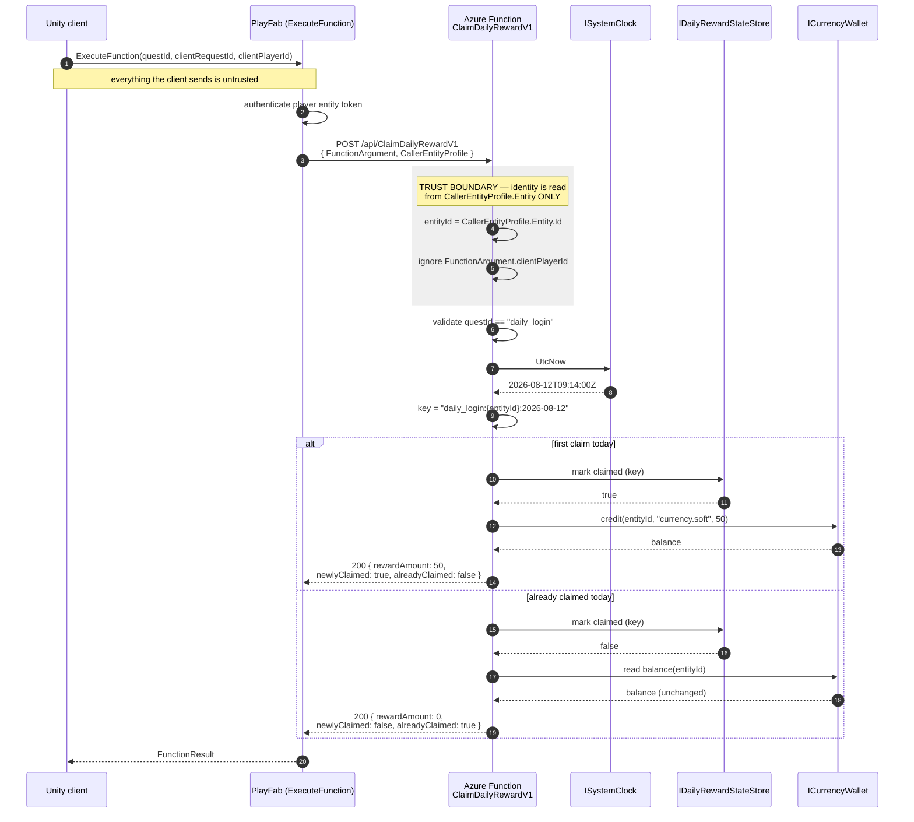

# GameBackend — Daily Reward Service

Azure Functions (.NET 8, isolated worker) backend for a Unity game's daily login reward.
A player calls `ClaimDailyRewardV1` through PlayFab CloudScript and receives **50 × `currency.soft`**,
**once per player per UTC day**, idempotently.

| | |
| --- | --- |
| Runtime | .NET 8 (`net8.0`), Azure Functions v4, **isolated** worker (`dotnet-isolated`) |
| Function | `ClaimDailyRewardV1` — HTTP `POST /api/ClaimDailyRewardV1` |
| Quest | `daily_login` |
| Reward | `50` of `currency.soft` |
| Tests | xUnit (`tests/GameBackend.Tests`) |
| IaC | Bicep (`infra/main.bicep`) |
| CI/CD | GitHub Actions (`.github/workflows/backend-ci.yml`), GitFlow |

```
GameBackend.sln
├─ src/GameBackend/                 function app (ClaimDailyRewardV1, models, DI wiring)
├─ tests/GameBackend.Tests/         xUnit tests
├─ infra/main.bicep                 storage, plan, function app, app insights, MI
└─ .github/workflows/backend-ci.yml build / test / IaC validate / package / gated deploys
```

---

## 1. Running the tests locally

```bash
dotnet restore GameBackend.sln
dotnet build   GameBackend.sln -c Release
dotnet test    GameBackend.sln -c Release
```

With a TRX log and coverage, matching what CI produces:

```bash
dotnet test GameBackend.sln -c Release \
  --logger "trx;LogFileName=test-results.trx" \
  --results-directory ./TestResults \
  --collect:"XPlat Code Coverage"
```

### ⚠️ Windows gotcha — the `dotnet` on `PATH` is runtime-only

On this machine `dotnet` resolves to `C:\Program Files\dotnet\dotnet.exe`, which is a
**runtime-only host with no SDK installed**. `dotnet --list-sdks` there returns nothing, and any
`dotnet build` / `dotnet test` fails with *"… requires the .NET SDK"*.

The .NET 8 SDK (**8.0.423**) is installed per-user at `%LOCALAPPDATA%\Microsoft\dotnet`.

Verify which one you have:

```powershell
dotnet --list-sdks                                    # empty  -> runtime-only host
& "$env:LOCALAPPDATA\Microsoft\dotnet\dotnet.exe" --list-sdks   # 8.0.423 [ ...\sdk ]
```

Fix it for the current shell by putting the SDK first on `PATH`:

```powershell
# PowerShell — current session only
$env:PATH = "$env:LOCALAPPDATA\Microsoft\dotnet;$env:PATH"
dotnet --list-sdks      # 8.0.423 ...
dotnet test GameBackend.sln -c Release
```

```bash
# Git Bash — current session only
export PATH="$LOCALAPPDATA/Microsoft/dotnet:$PATH"
dotnet test GameBackend.sln -c Release
```

Or invoke the SDK directly without touching `PATH`:

```powershell
& "$env:LOCALAPPDATA\Microsoft\dotnet\dotnet.exe" test GameBackend.sln -c Release
```

To make it permanent, add `%LOCALAPPDATA%\Microsoft\dotnet` **ahead of** `C:\Program Files\dotnet`
in the user `Path` environment variable. CI is unaffected — `actions/setup-dotnet@v4` provisions a
real SDK on the runner.

### Validating the infrastructure template

```bash
az bicep build --file infra/main.bicep
```

Exit code `0` with no warnings means the template compiles to ARM JSON. This is the same command CI
runs, and it needs **no Azure login and no credentials** — it is a pure offline compile.

### Running the function locally

```bash
func start --csharp   # requires Azure Functions Core Tools v4
```

`src/GameBackend/local.settings.json` holds local-only values and is git-ignored. It must never
contain a real PlayFab developer secret — see [section 4](#4-secrets-and-app-settings).

---

## 2. Architecture and request flow

### Components

| Layer | Responsibility |
| --- | --- |
| Unity client | Calls PlayFab `ExecuteFunction` with `questId` and a `clientRequestId` |
| PlayFab | Authenticates the player, stamps `CallerEntityProfile.Entity`, invokes the HTTP trigger |
| `ClaimDailyRewardV1` | Validates input, derives identity + idempotency key, grants or no-ops, returns the contract |
| `ISystemClock` | Supplies UTC "now" — injected so tests can pin a date and cross midnight deterministically |
| `IDailyRewardStateStore` | Records "this entity already claimed on this UTC day" |
| `ICurrencyWallet` | Credits the reward and reports the resulting balance |

The three interfaces are deliberate seams: they keep the claim rule pure and unit-testable, and they
are the exact points where the in-memory fakes get swapped for Cosmos DB and the real PlayFab
inventory API without touching the handler.

### Request flow



### Trust boundary — the load-bearing design decision

| Field | Source | How it is used |
| --- | --- | --- |
| `CallerEntityProfile.Entity.Id` | **PlayFab, server-side** | **The only** player identity. Drives the idempotency key and the wallet credit. |
| `FunctionArgument.clientPlayerId` | Client | **Deliberately ignored.** Bound only so the payload shape is explicit. Trusting it would let any player claim on another player's behalf. |
| `FunctionArgument.clientRequestId` | Client | **Trace only.** Logged for correlation. **Never** the dedup key — a client controls its value and could rotate it to replay a claim. |
| `FunctionArgument.questId` | Client | Validated against the known quest list; anything but `daily_login` is `UnknownQuest`. |

**Idempotency key:** `daily_login:{entityId}:{yyyy-MM-dd}` in **UTC**.

Every component of that key is server-derived. The date comes from `ISystemClock` in UTC, so the
reset boundary is unambiguous worldwide and a client cannot shift it by changing its device clock or
timezone.

### Response contract

**One response shape for every outcome.** Success and failure return the same object with all fields
always serialized (explicit `null`s included), so the Unity client binds a single schema and never
branches on whether a property exists. `errorCode` is the machine-readable discriminator.

**Errors**

| HTTP | `errorCode` | Cause |
| --- | --- | --- |
| `400` | `BadRequest` | Body missing, malformed, or a required field absent |
| `400` | `MissingCallerEntity` | `CallerEntityProfile.Entity` id/type missing or blank — the caller is unauthenticated, so there is no identity to grant against |
| `400` | `UnknownQuest` | `questId` is not `daily_login` |
| `502` | `UpstreamPlayFabError` | A downstream state or inventory dependency failed — the fault is upstream, not the client's |

Error codes are transport-agnostic constants owned by the domain layer; the function owns the
HTTP-status mapping. The string values are part of the public client contract and cannot change
without a version bump of the function (`…V1`).

**Success — first claim of the UTC day**

```json
{
  "success": true,
  "questId": "daily_login",
  "playerEntityId": "A1B2C3D4E5F60718",
  "claimDateUtc": "2026-08-12",
  "rewardCurrencyId": "currency.soft",
  "rewardAmount": 50,
  "newlyClaimed": true,
  "alreadyClaimed": false,
  "balance": 50,
  "errorCode": null,
  "errorMessage": null
}
```

**Success — repeat claim in the same UTC day**

Idempotent replay: still `200`, `rewardAmount` drops to `0`, and `balance` is **unchanged** from the
first call. The client can safely retry a dropped response without double-crediting.

```json
{
  "success": true,
  "questId": "daily_login",
  "playerEntityId": "A1B2C3D4E5F60718",
  "claimDateUtc": "2026-08-12",
  "rewardCurrencyId": "currency.soft",
  "rewardAmount": 0,
  "newlyClaimed": false,
  "alreadyClaimed": true,
  "balance": 50,
  "errorCode": null,
  "errorMessage": null
}
```

**Failure — missing caller entity**

```json
{
  "success": false,
  "questId": "daily_login",
  "playerEntityId": null,
  "claimDateUtc": null,
  "rewardCurrencyId": null,
  "rewardAmount": 0,
  "newlyClaimed": false,
  "alreadyClaimed": false,
  "balance": 0,
  "errorCode": "MissingCallerEntity",
  "errorMessage": "Caller entity is missing from the PlayFab request."
}
```

---

## 3. Assumptions and tradeoffs (2–3 hour timebox)

| Decision | Why | What production needs instead |
| --- | --- | --- |
| **In-memory fakes** behind `IDailyRewardStateStore` / `ICurrencyWallet` instead of Cosmos DB or Table Storage | Keeps the exercise runnable and tests hermetic with no cloud dependency; the interfaces are the real deliverable | Cosmos DB (or Table Storage) with the idempotency key as the partition/row key |
| **No distributed lock or atomic conditional write** | The fake store is a single-process dictionary; a real lock is meaningless without a real store | See the race below |
| **No real PlayFab SDK calls** | Would need a live title and a developer secret in source or CI — both unacceptable for a screening submission | `PlayFabEconomyAPI` / `AddInventoryItems` behind `ICurrencyWallet`, secret via Key Vault + managed identity |
| State is **lost on restart** | Consumption plan cold starts discard process memory | Durable store makes this moot |
| **No auth on the HTTP trigger beyond PlayFab** | PlayFab is the only intended caller | Function key or `authLevel: function`, plus IP restrictions / Private Endpoint |
| Reward amount and currency are **app settings**, not code constants | Live-ops tuning without a redeploy | Same, plus a remote config service if it needs to change per-cohort |

### The read-then-write race — known and deliberate

The current flow is *check whether the key exists, then write it*. Two concurrent requests for the
same player can both observe "not claimed" before either writes, and both grant the reward. The
window is small but real — a double-tap in the client or a retry on a slow response reproduces it.

A correct implementation makes claim-marking a **single atomic operation** and lets the storage
engine arbitrate:

- **Atomic conditional insert** — `INSERT` the idempotency key with a **unique-key constraint**; the
  loser gets a `409 Conflict`, which is the "already claimed" path. Preferred: the invariant lives in
  the database, not in application code.
- **ETag / optimistic concurrency** — read with an ETag, write with `If-Match`; retry the loser as a
  read.
- **Distributed lease** (blob lease, Redis lock) — works, but adds a failure mode (lock expiry,
  orphaned leases) for an invariant a unique key already enforces for free.

The seam is designed so this is a change *inside* `IDailyRewardStateStore` — the handler already
treats "mark claimed" as one call returning true/false, which is exactly the shape of an atomic
conditional insert.

---

## 4. Secrets and app settings

**Nothing secret is in this repository, and nothing secret is in the Bicep template.**

| Value | Kind | Where it lives |
| --- | --- | --- |
| `ENVIRONMENT` | Config | Function App setting, set by Bicep |
| `PLAYFAB_TITLE_ID` | Config (public — it ships inside the Unity client) | Function App setting / GitHub Actions **variable** |
| `DAILY_REWARD_AMOUNT` (`50`) | Config | Function App setting |
| `DAILY_REWARD_CURRENCY_ID` (`currency.soft`) | Config | Function App setting |
| `APPLICATIONINSIGHTS_CONNECTION_STRING` | Wiring | Set by Bicep from the App Insights resource |
| `AzureWebJobsStorage` | Credential | Resolved by ARM via `listKeys()` at deploy time — never written down |
| **`PLAYFAB_DEV_SECRET_KEY`** | **Secret** | **Azure Key Vault**, referenced by URI only |

### How the secret is actually resolved

The template sets a Key Vault *reference*, not a value:

```bicep
{
  name: 'PLAYFAB_DEV_SECRET_KEY'
  value: '@Microsoft.KeyVault(SecretUri=${playFabSecretUri})'
}
```

`playFabSecretUri` is a deployment parameter such as
`https://kv-curlyblue-prod.vault.azure.net/secrets/playfab-dev-secret-key`. That URI **names** a
secret; it does not contain one, so it is safe in a parameter file, in CI variables, and in logs.

At runtime App Service resolves the reference using the Function App's **system-assigned managed
identity**, which the template provisions. Grant it read access once per environment:

```bash
az role assignment create \
  --assignee-object-id  "$(az deployment group show -g <rg> -n main \
                            --query properties.outputs.functionAppPrincipalId.value -o tsv)" \
  --assignee-principal-type ServicePrincipal \
  --role "Key Vault Secrets User" \
  --scope "$(az keyvault show -n <vault> --query id -o tsv)"
```

**Rules this codebase follows:**

- Managed identity over connection strings and client secrets — there is no credential to leak, rotate, or commit.
- App settings are **configuration, not secrets**; only the PlayFab developer secret goes in Key Vault.
- Secret **values** never appear in source, Bicep, workflow YAML, logs, or `local.settings.json` (git-ignored).
- CI **echoes nothing** from a secret context; PR checks run with zero secrets at all (see below).
- Rotation is a Key Vault operation — add a new secret version; the app picks it up with no redeploy.
- Separate vault and separate title per environment, so a dev credential can never reach prod data.

---

## 5. CI/CD and deployment gating

### GitFlow branching model

| Trigger | Checks | Deploys to | Gate |
| --- | --- | --- | --- |
| `feature/*` → PR into `develop` | build + test + IaC validate | — | — |
| `develop` (push/merge) | full checks + package artifact | **DEV** | none — continuous deployment |
| `release/*` → PR into `main` | full checks + package | **STAGING** | GitHub environment `staging`, required reviewer |
| `main` tagged `v*` | package | **PROD** | GitHub environment `prod`, **manual approval** |
| `hotfix/*` → PR into `main` | full checks | (then tag → PROD) | approval, then **back-merge to `develop`** |

### Jobs

| Job | Does | Needs secrets |
| --- | --- | --- |
| `build-and-test` | `setup-dotnet@v4` (8.0.x) → restore → `build -c Release --no-restore` → `test --no-build` with TRX + XPlat coverage → upload results (`if: always()`) | **No** |
| `validate-iac` | `az bicep install` → `az bicep build --file infra/main.bicep` | **No** |
| `package` | `dotnet publish src/GameBackend/GameBackend.csproj -c Release -o ./publish` → zip → `upload-artifact@v4` | **No** |
| `deploy-dev` / `deploy-staging` / `deploy-prod` | download artifact → deploy (documented placeholder) | Yes, via the environment |
| `hotfix-backmerge-reminder` | Writes the back-merge checklist to the job summary | **No** |

### Security posture of the pipeline

- **PR checks run with zero secrets.** Nothing on the `build-and-test` → `validate-iac` → `package`
  path touches Azure, so a PR from any branch is safe and cannot exfiltrate anything.
- **Workflow-level least privilege:** `permissions: contents: read`. Deploy jobs opt into
  `id-token: write` only when OIDC federated login is turned on.
- **Approvals live in GitHub Environments**, not in YAML `if:` conditions — reviewers and environment
  secrets are configured in repository settings and cannot be bypassed by editing a branch.
- **No secret is ever echoed.** Deploy steps print intent only; the Azure commands are commented out
  until a federated credential exists.
- **Actions are pinned** to major version tags (`@v4`, `@v2`), and every job has a `timeout-minutes`.
- **Preferred credential:** OIDC federation (`azure/login@v2` with `client-id`/`tenant-id`) so no
  long-lived service-principal password is stored in GitHub at all.

### Deploying by hand

```bash
az group create -n rg-curlyblue-dev -l westeurope

az deployment group create \
  -g rg-curlyblue-dev \
  -f infra/main.bicep \
  -p environment=dev \
     playFabTitleId=<titleId> \
     playFabSecretUri=https://<vault>.vault.azure.net/secrets/playfab-dev-secret-key

az functionapp deployment source config-zip \
  -g rg-curlyblue-dev \
  -n "$(az deployment group show -g rg-curlyblue-dev -n main \
         --query properties.outputs.functionAppName.value -o tsv)" \
  --src GameBackend.zip
```

The template is **idempotent** — names derive from `uniqueString(resourceGroup().id)`, so re-running
it updates the same resources rather than creating new ones.

---

## 6. Monitoring, rollback, cleanup, next steps

### Monitoring and logging

Application Insights is workspace-based and wired via `APPLICATIONINSIGHTS_CONNECTION_STRING`;
`host.json` sets `telemetryMode: OpenTelemetry`, so worker traces flow through the OTel exporter.
Function App platform logs and metrics also stream to the same Log Analytics workspace, so one KQL
query spans traces and platform events.

Log **structured** properties, never interpolated strings — `entityId`, `questId`, `clientRequestId`,
`alreadyClaimed`, `rewardAmount`. `clientRequestId` is the correlation handle that stitches a Unity
client session to a server trace; it is a *log* field only and never a security or dedup decision.

```kusto
// Claim outcomes over the last day
traces
| where timestamp > ago(1d)
| where customDimensions.EventName == "DailyRewardClaim"
| summarize count() by tostring(customDimensions.alreadyClaimed), bin(timestamp, 1h)
```

Alerts worth having on day one:

| Alert | Condition | Why |
| --- | --- | --- |
| Upstream failures | `502 UpstreamPlayFabError` rate > 1% over 5 min | PlayFab degradation |
| Server errors | any `5xx` in a 5-minute window | Regression or bad deploy |
| Latency | P95 duration > 1 s | Cold start or a slow store |
| Anomalous claims | first-claim count per hour deviates sharply from baseline | Exploit attempt or a stuck reset boundary |
| Duplicate grants | more than one `rewardAmount: 50` for the same idempotency key | The read-then-write race firing in production |

### Rollback

1. **Slot swap** (preferred, seconds): deploy to a `staging` slot, verify, swap. Rollback is swapping
   back — the previous bits are still warm. Requires a plan that supports slots (Consumption does
   not; this is a reason to move prod to Premium/EP1).
2. **Redeploy the previous artifact:** every `package` run uploads `GameBackend.zip` with 30-day
   retention. Re-run `config-zip` with the artifact from the last known-good tag.
3. **Infrastructure:** re-run `az deployment group create` from the previous commit's
   `infra/main.bicep`. It is declarative and idempotent, so the previous shape is fully described.
4. **Config-only regressions:** `az functionapp config appsettings set` — no redeploy needed for
   `DAILY_REWARD_AMOUNT` and friends, which is exactly why they are settings.

### Cleanup

Everything lands in one resource group, so teardown is a single command:

```bash
az group delete --name rg-curlyblue-dev --yes --no-wait
```

Note that a soft-delete-enabled Key Vault survives this and must be purged separately
(`az keyvault purge`) before the same vault name can be reused.

### Next improvements

1. **Durable state store** — Cosmos DB with a unique-key constraint on the idempotency key, closing
   the read-then-write race described in section 3. Highest priority by far.
2. **Real PlayFab inventory integration** — implement `ICurrencyWallet` against `PlayFabEconomyAPI`,
   with the developer secret from Key Vault via managed identity.
3. **Rate limiting** — per-entity throttling so a client loop cannot hammer the endpoint; cheap on
   Consumption billing and a useful abuse signal.
4. **Load tests** — verify cold-start latency and concurrent-claim behaviour at the login-hour spike;
   specifically assert that N concurrent claims for one player grant exactly one reward.
5. **Premium plan + deployment slots** in prod for slot-swap rollback and no cold starts.
6. **Integration tests in CI** — spin the Functions host and exercise the full HTTP contract,
   including the 400/502 table, not just the handler.
7. **Health endpoint + availability test** — an App Insights availability probe so an outage is
   detected before players report it.
8. **Network hardening** — Private Endpoint on storage and Key Vault, `defaultAction: Deny` on the
   storage firewall once the function runs on a VNet-integrated plan.
