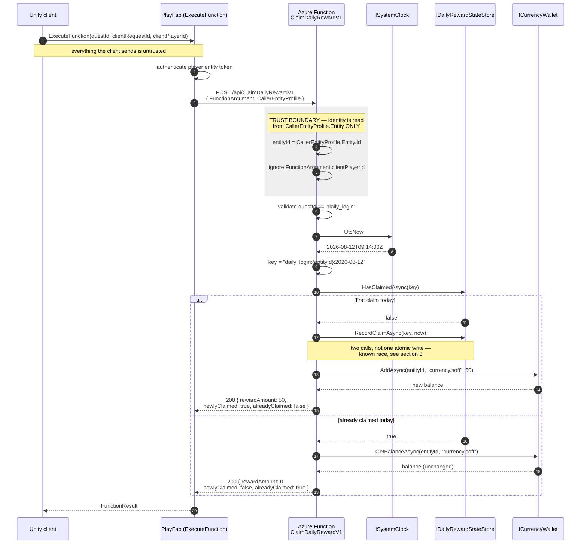

# GameBackend — Daily Reward Service

Azure Functions (.NET 8, isolated worker) backend for a Unity game's daily login reward.
A player calls `ClaimDailyRewardV1` through PlayFab CloudScript and receives **50 × `currency.soft`**,
**once per player per UTC day**, idempotently.

| | |
| --- | --- |
| Runtime | .NET 8 (`net8.0`), Azure Functions v4, **isolated** worker (`dotnet-isolated`) |
| Function | `ClaimDailyRewardV1` — HTTP `POST /api/ClaimDailyRewardV1` |
| Quest | `daily_login` |
| Reward | `50` of `currency.soft` |
| Tests | xUnit (`tests/GameBackend.Tests`) |
| IaC | Bicep (`infra/main.bicep`) |
| CI | GitHub Actions — `backend-ci.yml` (code) + `infra-ci.yml` (Bicep) |

```
GameBackend.sln
├─ src/GameBackend/                 function app (ClaimDailyRewardV1, models, DI wiring)
├─ tests/GameBackend.Tests/         xUnit tests
├─ infra/main.bicep                 storage, plan, function app, app insights, MI
└─ .github/workflows/
   ├─ backend-ci.yml                build / test / package the .NET project
   └─ infra-ci.yml                  compile + lint the Bicep template
```

## How this was built

Written with AI assistance — Claude Code, driven through two skill libraries (**Claude Octopus** and
**Matt Pocock's engineering skills**), used for structured critique of my own design rather than to
generate a solution unattended. I'm disclosing it because how the tooling was used is itself an
engineering decision, and I'd rather show that than have it inferred.

Where the tooling was wrong it was caught by building and running the code, not by reading it: a
"dead code" finding was false, and deleting the constructor broke the build. Every claim in this
README was checked against the source, and **`dotnet test`, `dotnet publish`, `az bicep build` and
`az bicep lint` were all executed against the final tree**, not assumed.

## Design decisions worth calling out

Choices made deliberately, which a reviewer may or may not agree with:

- **CI split by domain.** Code and infrastructure are separate workflows with separate status checks,
  so a red build names its own cause. The cost — `package` can't depend on the Bicep gate, since jobs
  can't span workflows — is re-coupled by branch protection requiring both.
- **No `paths:` filters, on purpose.** A path-filtered workflow that doesn't trigger never reports,
  and a *required* check that never reports blocks the PR forever. Both finish in ~2 minutes.
- **Nothing reaches a protected branch without a PR.** `develop` and `release/*` require a pull
  request, both status checks green, an up-to-date branch, and no force pushes — with
  `enforce_admins: true`, because a rule with an owner-shaped hole isn't a rule. Section 5 has the
  exact `gh api` call.
- **GitFlow is the intended branch model** — `develop` as trunk, `release/*` for stabilisation, no
  long-lived `main`, and a release identified by an immutable tag rather than a branch pointer.
  Only the branch *shape* is wired up here: the workflows and the protection rules target `develop`
  and `release/*`. The release-cut, tagging and back-merge automation is stated intent, not
  implemented — a half-built release train inside a 2-3 hour timebox would be worse than an honest
  statement of direction.
- **Zero secrets in the entire pipeline.** No job touches Azure, so a PR from any branch is safe and
  there is no credential in CI to leak.
- **The trust boundary is tested adversarially.** Every fixture that carries a payload at all carries
  a spoofed `clientPlayerId`, so the tests attack the trust boundary rather than cooperating with it.
- **A known limitation is documented in the code, not hidden.** The read-then-write race in
  `DailyRewardService` is commented at the exact lines it occurs, with the fix named.
- **Deployment is documented rather than stubbed.** The brief permits "clearly documented as a later
  step"; a job that only prints its intent looks like CD without being it.

---

## 1. Running the tests locally

```bash
dotnet restore GameBackend.sln
dotnet build   GameBackend.sln -c Release
dotnet test    GameBackend.sln -c Release
```

Expect **21 passing tests**. With a TRX log, matching what CI produces:

```bash
dotnet test GameBackend.sln -c Release \
  --logger "trx;LogFileName=test-results.trx" \
  --results-directory ./TestResults
```

Requires the .NET 8 **SDK** — `dotnet --list-sdks` must be non-empty. A runtime-only
install fails with *"… requires the .NET SDK"*.

### Validating the infrastructure template

```bash
az bicep build --file infra/main.bicep
```

Exit code `0` with no warnings means the template compiles to ARM JSON. This is the same command CI
runs, and it needs **no Azure login and no credentials** — it is a pure offline compile.

### Running the function locally

```bash
cd src/GameBackend
func start            # requires Azure Functions Core Tools v4
```

Wait for `ClaimDailyRewardV1: [POST] http://localhost:7071/api/ClaimDailyRewardV1`.

**Two ways to exercise it**, both covering the same six calls — first claim, idempotent repeat, a
varied `clientRequestId`, and the three rejection paths.

**In an editor:** open [`src/GameBackend/GameBackend.http`](src/GameBackend/GameBackend.http) and
send each request. Runs in Visual Studio 2022 (17.8+) and JetBrains IDEs with no extension, or in
VS Code with `code --install-extension humao.rest-client`.

**With curl:** request bodies are in [`samples/`](samples/). Run them in order, against a
**freshly started host** — state is a process-local singleton, so a second pass returns
`alreadyClaimed` on the first call. Restarting `func start` resets every balance and claim.

On PowerShell write `curl.exe`; plain `curl` there is an alias for `Invoke-WebRequest` and takes
entirely different arguments.

```bash
curl -s http://localhost:7071/api/ClaimDailyRewardV1 -H "Content-Type: application/json" -d @samples/1-claim.json      # 200  rewardAmount 50, newlyClaimed true
curl -s http://localhost:7071/api/ClaimDailyRewardV1 -H "Content-Type: application/json" -d @samples/1-claim.json      # 200  rewardAmount 0,  alreadyClaimed true
curl -s http://localhost:7071/api/ClaimDailyRewardV1 -H "Content-Type: application/json" -d @samples/2-varied-id.json  # 200  still alreadyClaimed — dedup ignores clientRequestId
curl -s http://localhost:7071/api/ClaimDailyRewardV1 -H "Content-Type: application/json" -d @samples/3-no-entity.json  # 400  MissingCallerEntity
curl -s http://localhost:7071/api/ClaimDailyRewardV1 -H "Content-Type: application/json" -d @samples/4-bad-quest.json  # 400  UnknownQuest
curl -s http://localhost:7071/api/ClaimDailyRewardV1 -H "Content-Type: application/json" -d @samples/5-garbage.txt     # 400  BadRequest (not 500)
```

`-d @file` implies POST, so no `-X` is needed. Add `-w '\n%{http_code}\n'` to print the status, and
pipe to `jq .` to format the body — but not both at once, since the appended status code makes the
output invalid JSON.

The first call returns `playerEntityId: "title_player_123"` — the authenticated entity — **not** the
`clientPlayerId: "do-not-trust-this-field"` that the same request also sends. That substitution is
the trust boundary in one line of output.

**No function key appears anywhere in `samples/` or the `.http` file, and none is needed locally:**
the host disables authorization regardless of `authLevel` when running outside Azure.

`src/GameBackend/local.settings.json` holds local-only values and is git-ignored. It must never
contain a real PlayFab developer secret — see [section 4](#4-secrets-and-app-settings).

---

## 2. Architecture and request flow

### Components

| Layer | Responsibility |
| --- | --- |
| Unity client | Calls PlayFab `ExecuteFunction` with `questId` and a `clientRequestId` |
| PlayFab | Authenticates the player, stamps `CallerEntityProfile.Entity`, invokes the HTTP trigger |
| `ClaimDailyRewardV1` | Validates input, derives identity + idempotency key, grants or no-ops, returns the contract |
| `ISystemClock` | Supplies UTC "now" — injected so tests can pin a date and cross midnight deterministically |
| `IDailyRewardStateStore` | Records "this entity already claimed on this UTC day" |
| `ICurrencyWallet` | Credits the reward and reports the resulting balance |

The three interfaces are deliberate seams: they keep the claim rule pure and unit-testable, and they
are the exact points where the in-memory fakes get swapped for Cosmos DB and the real PlayFab
inventory API without touching the handler.

### Request flow



### Trust boundary — the load-bearing design decision

| Field | Source | How it is used |
| --- | --- | --- |
| `CallerEntityProfile.Entity.Id` | **PlayFab, server-side** | **The only** player identity. Drives the idempotency key and the wallet credit. |
| `FunctionArgument.clientPlayerId` | Client | **Deliberately ignored.** Bound only so the payload shape is explicit. Trusting it would let any player claim on another player's behalf. |
| `FunctionArgument.clientRequestId` | Client | **Trace only.** Logged for correlation. **Never** the dedup key — a client controls its value and could rotate it to replay a claim. |
| `FunctionArgument.questId` | Client | Validated against the known quest list; anything but `daily_login` is `UnknownQuest`. |

**Idempotency key:** `daily_login:{entityId}:{yyyy-MM-dd}` in **UTC**.

Every component of that key is server-derived. The date comes from `ISystemClock` in UTC, so the
reset boundary is unambiguous worldwide and a client cannot shift it by changing its device clock or
timezone.

### Response contract

**One response shape for every outcome.** Success and failure return the same object with all fields
always serialized (explicit `null`s included), so the Unity client binds a single schema and never
branches on whether a property exists. `errorCode` is the machine-readable discriminator.

**Errors**

| HTTP | `errorCode` | Cause |
| --- | --- | --- |
| `400` | `BadRequest` | Body missing, malformed, or a required field absent |
| `400` | `MissingCallerEntity` | `CallerEntityProfile.Entity` id/type missing or blank — the caller is unauthenticated, so there is no identity to grant against |
| `400` | `UnknownQuest` | `questId` is not `daily_login` |
| `502` | `UpstreamPlayFabError` | A downstream state or inventory dependency failed — the fault is upstream, not the client's |

Error codes are transport-agnostic constants owned by the domain layer; the function owns the
HTTP-status mapping. The string values are part of the public client contract and cannot change
without a version bump of the function (`…V1`).

**Success — first claim of the UTC day**

`balance` is the player's real post-credit balance, so it depends on what they already held. The
in-memory wallet starts every player at zero, which is why a fresh host returns `50` here where the
brief's illustrative example shows `150` for a player who already had `100`. Every other field
matches the brief's contract exactly, including the explicit `null`s.

```json
{
  "success": true,
  "questId": "daily_login",
  "playerEntityId": "A1B2C3D4E5F60718",
  "claimDateUtc": "2026-08-12",
  "rewardCurrencyId": "currency.soft",
  "rewardAmount": 50,
  "newlyClaimed": true,
  "alreadyClaimed": false,
  "balance": 50,
  "errorCode": null,
  "errorMessage": null
}
```

**Success — repeat claim in the same UTC day**

Idempotent replay: still `200`, `rewardAmount` drops to `0`, and `balance` is **unchanged** from the
first call. The client can safely retry a dropped response without double-crediting.

```json
{
  "success": true,
  "questId": "daily_login",
  "playerEntityId": "A1B2C3D4E5F60718",
  "claimDateUtc": "2026-08-12",
  "rewardCurrencyId": "currency.soft",
  "rewardAmount": 0,
  "newlyClaimed": false,
  "alreadyClaimed": true,
  "balance": 50,
  "errorCode": null,
  "errorMessage": null
}
```

**Failure — missing caller entity**

Note that `claimDateUtc` and `rewardCurrencyId` are **still populated** on a failure — the server
knows both regardless of who is asking. Only `playerEntityId` is `null`, because that is precisely
what could not be established.

```json
{
  "success": false,
  "questId": "daily_login",
  "playerEntityId": null,
  "claimDateUtc": "2026-08-12",
  "rewardCurrencyId": "currency.soft",
  "rewardAmount": 0,
  "newlyClaimed": false,
  "alreadyClaimed": false,
  "balance": 0,
  "errorCode": "MissingCallerEntity",
  "errorMessage": "CallerEntityProfile.Entity.Id and Type are required."
}
```

---

## 3. Assumptions and tradeoffs (2–3 hour timebox)

| Decision | Why | What production needs instead |
| --- | --- | --- |
| **In-memory fakes** behind `IDailyRewardStateStore` / `ICurrencyWallet` instead of Cosmos DB or Table Storage | Keeps the exercise runnable and tests hermetic with no cloud dependency; the interfaces are the real deliverable | Cosmos DB (or Table Storage) with the idempotency key as the partition/row key |
| **No distributed lock or atomic conditional write** | The fake store is a single-process dictionary; a real lock is meaningless without a real store | See the race below |
| **No real PlayFab SDK calls** | Would need a live title and a developer secret in source or CI — both unacceptable for a screening submission | `PlayFabEconomyAPI` / `AddInventoryItems` behind `ICurrencyWallet`, secret via Key Vault + managed identity |
| State is **lost on restart** | Consumption plan cold starts discard process memory | Durable store makes this moot |
| **Only a function key guards the trigger** (`AuthorizationLevel.Function`) — PlayFab holds it | PlayFab is the only intended caller, and the reward logic rejects an unauthenticated caller anyway | IP restrictions or a Private Endpoint so the key is not the only network control |
| Reward amount and currency are **app settings**, not code constants | Live-ops tuning without a redeploy | Same, plus a remote config service if it needs to change per-cohort |

### The read-then-write race — known and deliberate

The current flow is *check whether the key exists, then write it*. Two concurrent requests for the
same player can both observe "not claimed" before either writes, and both grant the reward. The
window is small but real — a double-tap in the client or a retry on a slow response reproduces it.

A correct implementation makes claim-marking a **single atomic operation** and lets the storage
engine arbitrate:

- **Atomic conditional insert** — `INSERT` the idempotency key with a **unique-key constraint**; the
  loser gets a `409 Conflict`, which is the "already claimed" path. Preferred: the invariant lives in
  the database, not in application code.
- **ETag / optimistic concurrency** — read with an ETag, write with `If-Match`; retry the loser as a
  read.
- **Distributed lease** (blob lease, Redis lock) — works, but adds a failure mode (lock expiry,
  orphaned leases) for an invariant a unique key already enforces for free.

The seam contains the fix. `IDailyRewardStateStore` today exposes the race directly — `HasClaimedAsync`
then `RecordClaimAsync`, two calls. Correcting it means collapsing those into one
`TryRecordClaimAsync(key, now)` that returns `false` when the key already exists, which is exactly the
shape of an atomic conditional insert. That touches the interface, its implementation, and one branch
of `DailyRewardService` — the HTTP handler, the response contract and the tests' assertions are all
unaffected. It is left undone deliberately: with a single-process dictionary behind the interface
there is nothing for an atomic write to arbitrate, and pretending otherwise would hide the real
constraint rather than name it.

---

## 4. Secrets and app settings

**Nothing secret is in this repository, and nothing secret is in the Bicep template.**

| Value | Kind | Where it lives |
| --- | --- | --- |
| `ENVIRONMENT` | Config | Function App setting, set by Bicep |
| `PLAYFAB_TITLE_ID` | Config (public — it ships inside the Unity client) | Function App setting / GitHub Actions **variable** |
| `DAILY_REWARD_AMOUNT` (`50`) | Config | Function App setting |
| `DAILY_REWARD_CURRENCY_ID` (`currency.soft`) | Config | Function App setting |
| `APPLICATIONINSIGHTS_CONNECTION_STRING` | Wiring | Set by Bicep from the App Insights resource |
| `AzureWebJobsStorage` | Credential | Resolved by ARM via `listKeys()` at deploy time — never written down |
| **`PLAYFAB_DEV_SECRET_KEY`** | **Secret** | **Azure Key Vault**, referenced by URI only |

### How the secret is actually resolved

The template sets a Key Vault *reference*, not a value:

```bicep
{
  name: 'PLAYFAB_DEV_SECRET_KEY'
  value: '@Microsoft.KeyVault(SecretUri=${playFabSecretUri})'
}
```

`playFabSecretUri` is a deployment parameter such as
`https://kv-curlyblue-prod.vault.azure.net/secrets/playfab-dev-secret-key`. That URI **names** a
secret; it does not contain one, so it is safe in a parameter file, in CI variables, and in logs.

At runtime App Service resolves the reference using the Function App's **system-assigned managed
identity**, which the template provisions. Grant it read access once per environment:

```bash
az role assignment create \
  --assignee-object-id  "$(az deployment group show -g <rg> -n main \
                            --query properties.outputs.functionAppPrincipalId.value -o tsv)" \
  --assignee-principal-type ServicePrincipal \
  --role "Key Vault Secrets User" \
  --scope "$(az keyvault show -n <vault> --query id -o tsv)"
```

**Rules this codebase follows:**

- Managed identity over connection strings and client secrets — there is no credential to leak, rotate, or commit.
- App settings are **configuration, not secrets**; only the PlayFab developer secret goes in Key Vault.
- Secret **values** never appear in source, Bicep, workflow YAML, logs, or `local.settings.json` (git-ignored).
- CI **echoes nothing** from a secret context; PR checks run with zero secrets at all (see below).
- Rotation is a Key Vault operation — add a new secret version; the app picks it up with no redeploy.
- Separate vault and separate title per environment, so a dev credential can never reach prod data.

---

## 5. CI and deployment

### Two workflows, split by domain

Both run on pushes to `develop` and `release/*`, on PRs targeting either, and on manual dispatch.
Neither touches Azure, so **no job anywhere needs a secret**.

**`backend-ci.yml`** — the .NET project:

| Job | Does |
| --- | --- |
| `build-and-test` | `setup-dotnet@v4` (8.0.x) -> restore -> `build -c Release` -> `test --no-build` with TRX -> upload results (`if: always()`) |
| `package` | `dotnet publish -c Release` -> zip -> `upload-artifact@v4` (30-day retention) |

**`infra-ci.yml`** — the Bicep template:

| Job | Does |
| --- | --- |
| `validate-bicep` | `az bicep install` -> `az bicep build` (compile to ARM) -> `az bicep lint` |

Compiling to ARM is a pure offline operation — no login, no subscription, no credential — which is
why it can run on a PR from any branch. It is worth being precise about what that does and does not
prove: `bicep build` catches syntax errors, bad API versions, broken references and parameter type
errors, but it does **not** prove the template deploys. Name collisions, regional SKU availability,
quota and RBAC only surface against a real subscription. The next rungs up are
`az deployment group validate` and `az deployment group what-if` — both need a subscription but
create nothing, so they belong in an environment-gated job once one exists.

They are separate so a red check names its own domain — a broken template does not read as a broken
service — and so each can gain its own required reviewers via `CODEOWNERS` without dragging the
other along. The cost is that `package` cannot depend on the Bicep gate: GitHub jobs cannot span
workflows. Branch protection is what actually holds the line, by requiring **both** checks green
before a merge.

**No `paths:` filters, deliberately.** A path-filtered workflow that does not trigger never reports
a status, and a required status check that never reports leaves the PR blocked forever. Both
workflows finish in about two minutes, so always running them costs far less than that failure
mode. Adding path filters later means giving every required check an `always()`-guarded gate job to
report on the skipped path.

**Security posture:**

- **Zero secrets across both workflows**, so a PR from any branch is safe and cannot exfiltrate
  anything. There is no credential in the pipeline to leak.
- **Workflow-level least privilege:** `permissions: contents: read`.
- **Actions pinned** to major version tags (`@v4`), and every job has a `timeout-minutes`.

### Branch protection — nothing lands without a PR

**This cannot live in a workflow file.** A workflow runs *after* a push; it cannot refuse one.
Blocking direct commits is a repository setting, applied to the remote. `develop` and `release/*`
are the protected branches.

What the rule enforces:

| Setting | Why |
| --- | --- |
| Require a pull request before merging | No direct pushes, including by admins |
| Require status checks: **Build and test**, **Package artifact**, **Validate Bicep** | Both workflows must be green — this is what re-couples the split |
| Require branches to be up to date before merging | Prevents a merge that passes CI only in isolation |
| Block force pushes | History on a protected branch stays append-only |
| Block deletions | The trunk cannot be removed |
| Include administrators | A rule with an owner-shaped hole is not a rule |

Applied once per repository, after the remote exists:

```bash
gh api -X PUT repos/:owner/:repo/branches/develop/protection \
  --input - <<'JSON'
{
  "required_status_checks": {
    "strict": true,
    "contexts": ["Build and test", "Package artifact", "Validate Bicep"]
  },
  "required_pull_request_reviews": { "required_approving_review_count": 1 },
  "enforce_admins": true,
  "restrictions": null,
  "allow_force_pushes": false,
  "allow_deletions": false
}
JSON
```

The status-check names are the workflow jobs' `name:` values, not the job ids. They only become
selectable in the GitHub UI once each workflow has completed at least one run, so push first, let
both go green, then apply the rule.

On a solo repository, drop `required_pull_request_reviews` — you cannot approve your own PR, and a
rule you have to bypass to work is worse than one scoped honestly. Everything else still applies.

### Deployment (not automated yet)

**Deployment is deliberately a documented manual step, not a pipeline job.** Automating it would
require an Azure subscription and a federated credential that this exercise explicitly does not
assume, and a stubbed deploy job that only echoes its intent is worse than an honest procedure.

Deploy by hand:

```bash
az group create -n rg-curlyblue-dev -l westeurope

az deployment group create   -g rg-curlyblue-dev   -f infra/main.bicep   -p environment=dev      playFabTitleId=<titleId>      playFabSecretUri=https://<vault>.vault.azure.net/secrets/playfab-dev-secret-key

az functionapp deployment source config-zip   -g rg-curlyblue-dev   -n "$(az deployment group show -g rg-curlyblue-dev -n main          --query properties.outputs.functionAppName.value -o tsv)"   --src GameBackend.zip
```

The template is **idempotent** — names derive from `uniqueString(resourceGroup().id)`, so re-running
it updates the same resources rather than creating new ones.

**How it would be gated when automated.** Add one deploy job per environment, each with a GitHub
`environment:` block — `dev` with no reviewers (continuous), `staging` and `prod` with required
reviewers, so the job parks on "waiting for approval" rather than deploying unattended. Approvals
belong in GitHub Environments rather than YAML `if:` conditions, because environment protection
rules cannot be bypassed by editing a branch. Authenticate with **OIDC federation**
(`azure/login@v2` with `client-id`/`tenant-id`, job-level `id-token: write`) so no long-lived
service-principal password is ever stored in GitHub.

---

## 6. Monitoring, rollback, cleanup, next steps

### Monitoring and logging

Application Insights is workspace-based and wired via `APPLICATIONINSIGHTS_CONNECTION_STRING`, which
the Bicep template sets from the App Insights resource; the Functions host picks it up and ships
worker traces with no extra wiring in `Program.cs`. Function App platform logs and metrics stream to
the same Log Analytics workspace, so one KQL query spans traces and platform events.

Both claim outcomes are logged as **structured** properties, never interpolated strings. Each
`LogInformation` in `DailyRewardService` emits the same property set — `PlayerEntityId`, `QuestId`,
`ClaimDateUtc`, `IdempotencyKey`, `AlreadyClaimed`, `RewardAmount`, `ClientRequestId` — so one query
spans the granted and duplicate paths. `ClientRequestId` is the correlation handle that stitches a
Unity client session to a server trace; it is a *log* field only, never a security or dedup decision.

```kusto
// Claim outcomes over the last day
traces
| where timestamp > ago(1d)
| extend alreadyClaimed = tostring(customDimensions.AlreadyClaimed)
| where isnotempty(alreadyClaimed)
| summarize count() by alreadyClaimed, bin(timestamp, 1h)
```

```kusto
// Duplicate grants — the read-then-write race firing in production. Should always be empty.
traces
| where timestamp > ago(1d)
| where tostring(customDimensions.AlreadyClaimed) == "False"
| summarize grants = count() by key = tostring(customDimensions.IdempotencyKey)
| where grants > 1
```

Alerts worth having on day one:

| Alert | Condition | Why |
| --- | --- | --- |
| Upstream failures | `502 UpstreamPlayFabError` rate > 1% over 5 min | PlayFab degradation |
| Server errors | any `5xx` in a 5-minute window | Regression or bad deploy |
| Latency | P95 duration > 1 s | Cold start or a slow store |
| Anomalous claims | first-claim count per hour deviates sharply from baseline | Exploit attempt or a stuck reset boundary |
| Duplicate grants | the second query above returns any row | The read-then-write race firing in production — the one alert I would want before shipping |

### Rollback

1. **Slot swap** (preferred, seconds): deploy to a `staging` slot, verify, swap. Rollback is swapping
   back — the previous bits are still warm. Requires a plan that supports slots (Consumption does
   not; this is a reason to move prod to Premium/EP1).
2. **Redeploy the previous artifact:** every `package` run uploads `GameBackend.zip` with 30-day
   retention. Re-run `config-zip` with the artifact from the last known-good tag.
3. **Infrastructure:** re-run `az deployment group create` from the previous commit's
   `infra/main.bicep`. It is declarative and idempotent, so the previous shape is fully described.
4. **Config-only regressions:** `az functionapp config appsettings set` — no redeploy needed for
   `DAILY_REWARD_AMOUNT` and friends, which is exactly why they are settings.

### Cleanup

Everything lands in one resource group, so teardown is a single command:

```bash
az group delete --name rg-curlyblue-dev --yes --no-wait
```

Note that a soft-delete-enabled Key Vault survives this and must be purged separately
(`az keyvault purge`) before the same vault name can be reused.

### Next improvements

1. **Durable state store** — Cosmos DB with a unique-key constraint on the idempotency key, closing
   the read-then-write race described in section 3. Highest priority by far.
2. **Real PlayFab inventory integration** — implement `ICurrencyWallet` against `PlayFabEconomyAPI`,
   with the developer secret from Key Vault via managed identity.
3. **Function-layer tests** — the handler's status mapping and JSON deserialization are currently
   covered only indirectly. `MapStatusCode` is `internal`, so `InternalsVisibleTo` makes the whole
   400/502 table a `[Theory]` with no HTTP host.
4. **Automated deployment** — the gated dev/staging/prod jobs described in section 5, once an OIDC
   federated credential exists.
